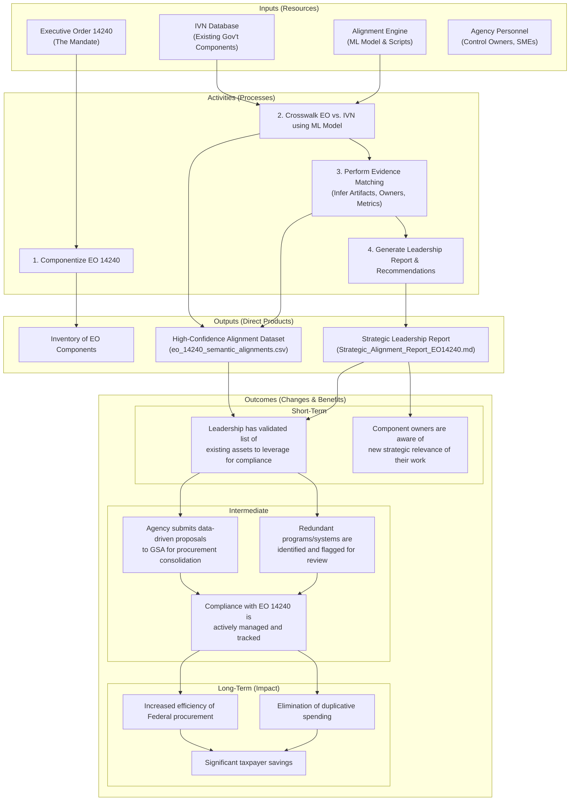

# Logic Model for EO 14240 Alignment and Compliance

```mermaid
graph TD
    subgraph "Inputs (Resources)"
        A1["Executive Order 14240<br>(The Mandate)"]
        A2["IVN Database<br>(Existing Gov't Components)"]
        A3["Alignment Engine<br>(ML Model & Scripts)"]
        A4["Agency Personnel<br>(Control Owners, SMEs)"]
    end

    subgraph "Activities (Processes)"
        B1["1. Componentize EO 14240"]
        B2["2. Crosswalk EO vs. IVN using ML Model"]
        B3["3. Perform Evidence Matching<br>(Infer Artifacts, Owners, Metrics)"]
        B4["4. Generate Leadership Report & Recommendations"]
    end

    subgraph "Outputs (Direct Products)"
        C1["Inventory of EO Components"]
        C2["High-Confidence Alignment Dataset<br>(eo_14240_semantic_alignments.csv)"]
        C3["Strategic Leadership Report<br>(Strategic_Alignment_Report_EO14240.md)"]
    end

    subgraph "Outcomes (Changes & Benefits)"
        subgraph "Short-Term"
            D1["Leadership has validated list of<br>existing assets to leverage for compliance"]
            D2["Component owners are aware of<br>new strategic relevance of their work"]
        end
        subgraph "Intermediate"
            D3["Agency submits data-driven proposals<br>to GSA for procurement consolidation"]
            D4["Redundant programs/systems are<br>identified and flagged for review"]
            D5["Compliance with EO 14240 is<br>actively managed and tracked"]
        end
        subgraph "Long-Term (Impact)"
            D6["Increased efficiency of Federal procurement"]
            D7["Elimination of duplicative spending"]
            D8["Significant taxpayer savings"]
        end
    end

    A1 --> B1
    A2 & A3 --> B2
    B2 --> B3
    B3 --> B4
    B1 --> C1
    B2 & B3 --> C2
    B4 --> C3
    C2 & C3 --> D1
    C3 --> D2
    D1 --> D3
    D1 --> D4
    D3 & D4 --> D5
    D5 --> D6
    D5 --> D7
    D6 & D7 --> D8
```
