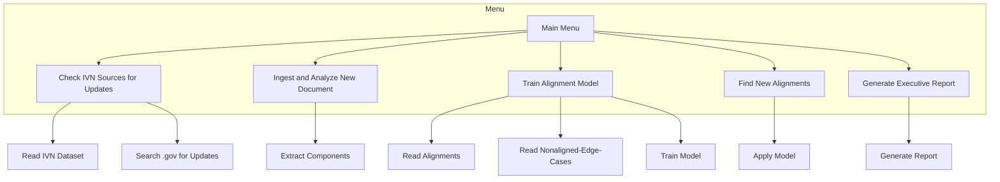

```mermaid
graph TD
    subgraph Menu
        A[Main Menu]
        B1[Check IVN Sources for Updates]
        B2[Ingest and Analyze New Document]
        B3[Train Alignment Model]
        B4[Find New Alignments]
        B5[Generate Executive Report]
    end
    A --> B1
    A --> B2
    A --> B3
    A --> B4
    A --> B5
    B1 --> C1[Read IVN Dataset]
    B1 --> C2[Search .gov for Updates]
    B2 --> D1[Extract Components]
    B3 --> E1[Read Alignments]
    B3 --> E2[Read Nonaligned-Edge-Cases]
    B3 --> E3[Train Model]
    B4 --> F1[Apply Model]
    B5 --> G1[Generate Report]
```
